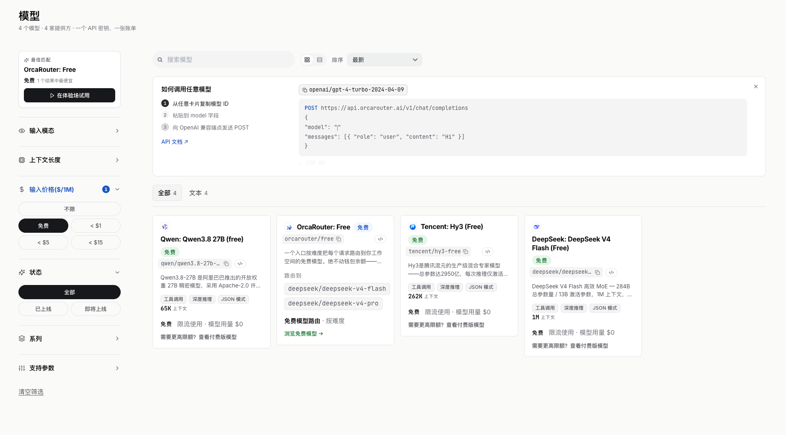

> ### 近期新增
> 
> 2026-9-3: OrcaRouter、Conduit、kktoken

以下站点都是本人收集整理，没有收取任何费用，也不存在付费推广。

站点的评价内容纯主观个人体验，仅供参考。

## 公益中转站

> 公益中转站的安全性无法保证，请注意数据或隐私安全。
> 
> 使用中转站前请先阅读这篇文章 👇。
> 
> 【AI供应链威胁】API 中转站投毒的攻击链深入分析
> 
> 文章转载自
> 
> 先知社区 作者：Fausto [https://xz.aliyun.com/news/92154](https://xz.aliyun.com/news/92154)

<h3>AgentRouter</h3>

评价：**夯**

站长还会根据用户使用量增送余额，越活越的用户送的额度越多。

每天签到可获得25余额，邀请一个用户可获150余额。

使用以下链接注册可获170额度。

[https://agentrouter.org/register?aff=QieS](https://agentrouter.org/register?aff=QieS)

<h3>AnyRouter</h3>

评价：**顶级**

这是一家老牌的中转站，稳定性一般，速度较慢。

目前仅CC可用，其他的需要挤。

每天签到可获得25余额，邀请一个用户可获50余额。

使用以下链接注册可获50额度。

[https://anyrouter.top/register?aff=78Jy](https://anyrouter.top/register?aff=78Jy)

<h3>GoRouter</h3>

评价：**NPC**

速度可以，消耗额度有点高。

每天签到可获得6-9余额。

[https://gorouter.app/sign-up?aff=C58L](https://gorouter.app/sign-up?aff=C58L)

<h3>SeekAI</h3>

评价：**无**

还没有测试过，不过送的额度多。

新用户使用邀请码注册可以获得200余额，每日签到可获得20余额，邀请一人可获得20余额（拉人就这点拉完了）。

[https://seekai.cc/sign-up?aff=fjxq](https://seekai.cc/sign-up?aff=fjxq)

<h3>哈吉米AI</h3>

评价：**无**

这也是一个没有测试过的站点，模型价格高。

新用户使用邀请码注册可以获得100余额，每日签到随机5-9余额。

[https://api.gemai.cc/sign-up?aff=GmYKJSLl](https://api.gemai.cc/sign-up?aff=GmYKJSLl)

<h3>TabToken</h3>

评价：**无**

这也是一个没有测试过的站点，模型价格有点高。

新用户使用邀请码注册可以获得100余额，每日签到随机5-9余额，邀请一人可获得20余额（拉人就这点拉完了）。

[https://tabitoken.com/sign-up?aff=6boQ](https://tabitoken.com/sign-up?aff=6boQ)

<h3>JustDoWork</h3>

评价：无

这也是一个没有测试过的站点，模型价格有点还好。

新用户使用邀请码注册可以获得200余额，每日签到随机5-9余额，邀请一人可获得40余额。

[https://api.justwoker.icu/register?aff=Qk1K](https://api.justwoker.icu/register?aff=Qk1K)

<h3>Conduit</h3>

评价：无

Gpt速度快可以用。

新用户点击链接打开TG按照流程注册，注册完成后新用户可获得500余额使用。

[https://t.me/conduitoff_bot?start=ref_6406492700](https://t.me/conduitoff_bot?start=ref_6406492700)

<h3>kktoken AI</h3>

评价：无

新用户使用邀请码注册可以获得200余额，每日签到20余额。

[https://kktoken.cc/sign-up?aff=GGv5](https://kktoken.cc/sign-up?aff=GGv5)

## 一些大牌AI

<h3>Nvidia</h3>

评价：**顶级**

免费的智能模型不算多，可以留意一下之前免费使用DeepSeek V4。

目前免费的有智普

[https://build.nvidia.com/models](https://build.nvidia.com/models)

<h3>FreeBuff</h3>

评价：**顶级**

每天免费无限使用DeepSeek V4 Flash 三个小时（似乎），如果没有那就是这个区域停掉了，换个美国、印度什么的就可以继续用了。

当前日期2026-8-19。近期香港无法使用，需要换到美国节点。

[https://freebuff.com/get-started?ref=ref-249b9117-b0e0-439d-bac9-0762fd289053&referrer=Listensay](https://freebuff.com/get-started?ref=ref-249b9117-b0e0-439d-bac9-0762fd289053&referrer=Listensay)

<h3>TokenRouter</h3>

评价：**顶级**

真正意义的无限免费使用。

有时免费kimi v3、deepseek v4 pro、qwen3.8 max、Glm等。

需要注意的是这些免费模型不太建议接入agent，如果上下文内容长起来了就会出现文字混乱的问题。

但是其实影响结论不是很大，你让他执行任务都还是OK的，只是任务执行完成后结果有点看不懂，你可以纠正他的行为下次回复他就正常了。

[https://www.tokenrouter.com/](https://www.tokenrouter.com/)

这里我推荐Hermas agent去使用这个API，你可以在前面让Agent记忆一下（直接打字让他记住），如果模型输出文字错乱的话就重新输出。

总而言之这个网站的免费模型输出阅读性不好，工作是没有问题的。

<h3>OrcaRouter</h3>

评价：**夯**

虽然有点限制，但是可以忽略，免费模型不多，整体体验下来速度非常快。

[https://www.orcarouter.ai/](https://www.orcarouter.ai/)

## 一些不明来历的AI，但是能用

这些AI都不建议使用。

<h3>http://20.115.208.7:4000/v1</h3>

不需要输入密钥使用这些模型

[http://20.115.208.7:4000/v1](http://20.115.208.7:4000/v1)

<h3>http://130.210.35.157:4000/v1</h3>

同样不需要输入密钥使用这些模型

[http://130.210.35.157:4000/v1](http://130.210.35.157:4000/v1)

