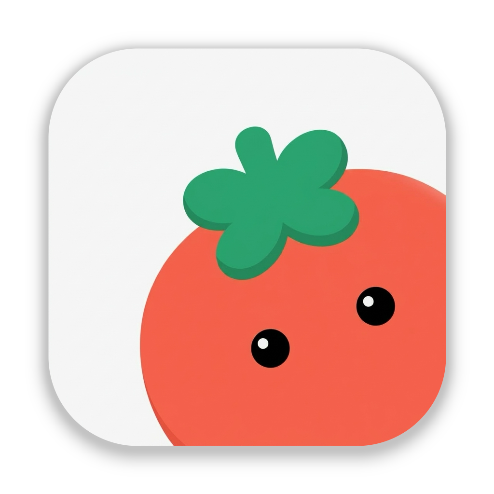

如果你正在开发一款 App、效率工具、游戏或者个人项目，想为它设计一个可爱又有辨识度的 IP 形象，但自己又不太会画画，可以试试现在这种 **AI Agent + Skill** 的方式。

整个过程不需要自己研究复杂的提示词，只需要让 AI Agent 安装一个专门用于 **IP Logo 设计与生成** 的 Skill，就可以直接开始创作。

## 前提准备

首先，你需要准备一个**支持图片生成的 AI Agent**。

例如：

- ChatGPT
- Claude
- Gemini
- 其他支持 Skill 的 AI Agent

然后，在 Agent 中输入下面这条命令：

```bash
npx skills@latest add s1dashu/ip-as-logo-skill
```

Agent 会自动识别并安装这个 Skill。

安装完成后，就可以直接告诉 AI 你想设计什么样的 IP 形象了。

## 开始设计

例如，我想为自己的效率工具设计一个 IP，可以直接输入：

> 为我的效率工具设计一个非常简单、可爱的圆角小熊 IP，背景为低饱和深蓝色。

接下来，Skill 会根据你的需求开始进行设计。

相比于单纯让 AI“帮我画一个 Logo”，这种方式会先对产品和设计需求进行整理，再逐步生成候选方案。

### 整体流程

这个 Skill 默认会按照下面的流程工作：

1. **了解产品背景**

   首先了解你的产品是什么、面向什么用户，以及 IP 需要承担什么作用。如果当前 Agent 能读取项目上下文，也会优先结合项目内容进行分析。
2. **提出 3 个设计方向**

   AI 会先给出三个不同的设计方向，而不是直接开始生成图片。
3. **生成候选方案**

   默认建议生成 **6 个独立候选图**，方便你从不同方案中进行选择。
4. **确认设计方案**

   确认之后，Skill 会按照 `A1` 到 `C2` 的编号生成六张最终候选图。
5. **统一视觉规范**

   每张图默认采用正方形构图，并使用三种语义颜色，同时让 IP 从左下角或右下角进入画面，方便后续用于不同的产品场景。

这样一来，整个设计过程就从“让 AI 随便画一张图”，变成了一个相对完整的 **IP 设计流程**。

## 图片生成效果

Gemini 示例

提示词

> 为我的效率工具设计一个非常简单、可爱的圆角番茄IP，背景颜色需要你给我几个方案进行选择。

最终生成的效果如下：


