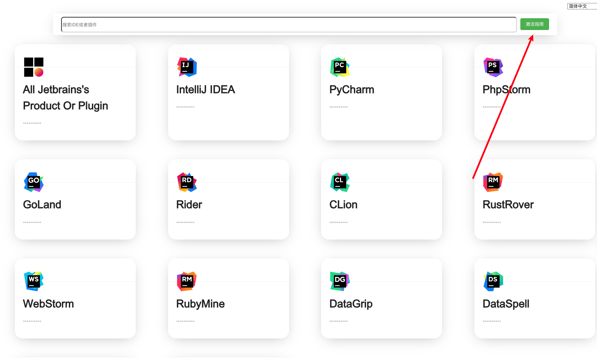
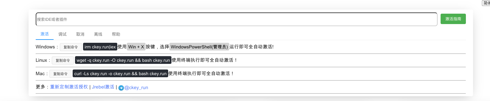
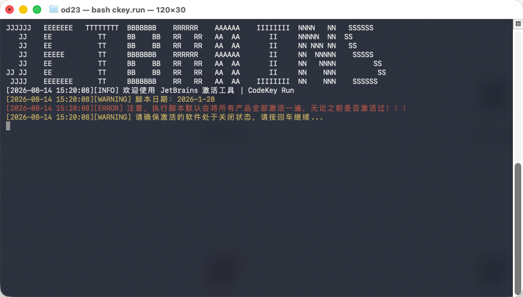
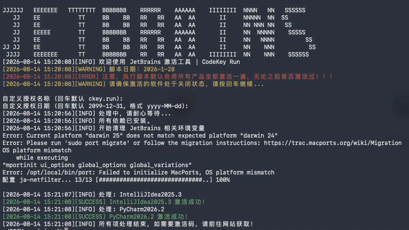
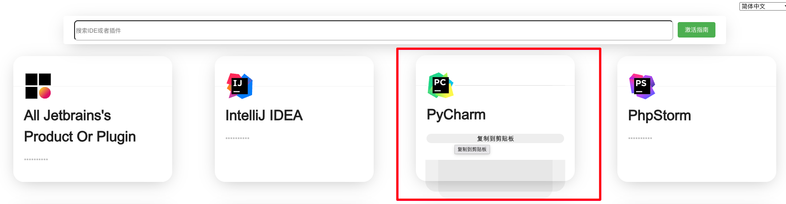

首先打开网址：

https://www.jetbrains.com/

下载你需要破解的ide，我这里选择PyCharm。点击下载然后直接安装。

安装完成后打开网址。

https://ckey.run/

打开网址后点击箭头指向的安装指南。

根据你的系统复制对应的命令进行全自动激活。

执行命令。

一直默认回车即可。

显示这样子的效果就代表破解成功了，这个时候就可以打开软件测试了。

如果打开软件提示了需要激活码激活的话，回到网站选择对应的ide，复制激活码，然后粘贴进软件就好了。

